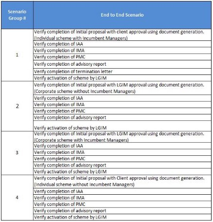
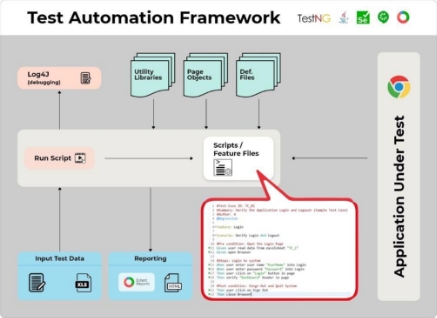
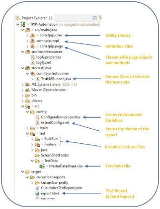
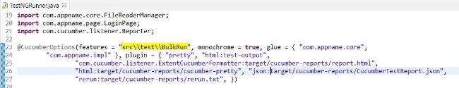
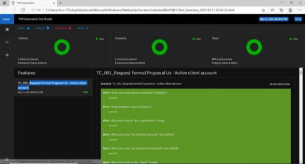
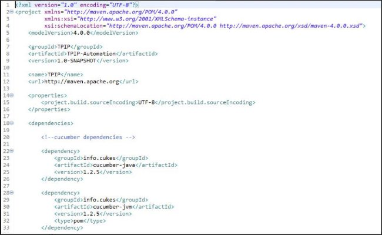

**Test Automation Architecture For TPIP** 

 

**Document Revisions**

|**Version** |**Status** |**Date** |**Change Summary** |**Owner/Author** |
| - | - | - | - | - |
|0.1 |Completed |18/06/2021 |Initial Version |Lalindra |

**Document Handling**

This document is strictly for 1 Billion Tech and Client use only. This shall not be shared with any external party other than the client concerned. This document should always be kept securely, and employees shall use reasonable care protecting this from unauthorized use or disclosure to a third party.  
 

**1.  Introduction** 

   (1.1) ***Purpose*** 

This document presents the comprehensive architectural overview of the Test-Automation solution for **TPIP Test Automation** project. This Automation Architecture document will be used as the basis for all test automation activities. The intended audience for this document is the **TPIP** Project Team and the **1 Billion Tech** Project Team. 

   (1.2) ***Scope*** 

This document is related to the test automation done for the selected set of Regression Test Cases of **LGIM NavGuide** application by the 1 Billion Tech QA Team.  

This  document  contains  the  scope  of  the  automation,  test  framework,  quality  attributes,  the environment details, and the critical success factors of the solution.  

   (1.3) ***Definitions, Acronyms, and Abbreviations*** 

|**Term** |**Description** |
| - | - | 
|NA |Not Applicable |
|TBD |To be determined |
|UI |User Interface |
|UC |Use Case |
|BDD |Behavior Driven Development |
|PO |Page Object |

*Table 1: Definitions, Acronyms, and Abbreviations*

   (1.4) ***References***

|**No** |**Document Name** |**Version** |**Location** |
| - | - | - | - |
|1 |Regression Test Suite |NA | https://drive.google.com/drive/u/0/folders/1cQkV8r_oCQdH20rl3iWurYVxtcDYVboF|

*Table 2: Reference Documents* 

 

**2.  Scope of the Automation** 

The scope of this automation is limited to the Registration Regression and the details of the In- Scope areas are as follows. 

  (2.1) ***In-Scope*** 

*Table 3: Regression Scenarios*

***Note:** These 25 scenarios are covered within 4 End-To-End Scenario scripts (i.e., Scenario Group 1-4).* 

 

**3.  Test Framework** 

This framework relies on Selenium and Cucumber in order to support BDD which makes it easy to read and to understand the application flow for any user of the automated suite. 

*Figure 1: Automation Framework* 

The structure of the automation suite is illustrated in the image below.  

*Figure 2: Framework Structure* 

(3.1) ***Library*** 

This consists of common class files that can be used application wide. All these Library files (e.g. Driver class, ExcelUtils class, Configuration File reader class, etc.) are packaged under the “com.tpip.core” package. 

(3.2) ***Definition Files*** 

Step definition files are used to store the mapping between each step of the scenario defined in the feature file with  the  code  of  function  to  be  executed  which  are  defined  under  page  object classes. These files are packaged under the “com.tpip.impl” package. 

(3.3) ***Drivers*** 

Driver will be handled by the “Driver” class located in the com.tpip.core package. 

Driver exe file location will be teken from the “Configuration” property file located in “\\src\\config\\Configuration.properties”. 

Chrome Driver is used for the solution, as the automated suite developed and planning to execute on Chrome browser. 

(3.4) ***Object Repository*** 

All the classes which consist of all page objects and reusable common methods will be handled under the Object Repository. These classes are packaged under the “com.tpip.page” package. 

- PO Package: 

*Figure 3: Page Object Classes* 

- Sample code snippet: 

*Figure 4: Sample Code* 

(3.5) ***Test Case Management*** 

Separate feature file has been created for each test case/scenario. Without packaging all test cases in a single folder, several folders can be created to group the test cases at the UC / Feature level for easy maintenance. 

Given below is the list of folders aligned with the solution to store test cases.  

1. BulkRun – To maintain the Feature Files/Test Cases to be executed in a particular cycle. 
1. Feature – To maintain all the Feature Files/Test Cases belonging to the complete project. 

*Figure 5: Feature File Folders* 

Currently the Runner class is configured to run the Feature files under “BulkRun” folder as highlighted in the below image, but this path can be changed accordingly to run the Feature files under other folders as well. 

*Figure 6: Feature File Folder Path in Runner Class* 

- Sample code snippet of a Feature File / Test Case: 

*Figure 7: Sample Feature File* 

(3.6) ***Data Management*** 

This framework is blended with the Data Driven capabilities by storing the data in spreadsheet format to maintain all Test Data separately. 

A separate class named: “ExcelUtils” has been used to implement this capability.  

The spreadsheet is located under “/webcrm/src/test/TestData/” and the data will be grouped under different tabs for each Feature file. 

This spreadsheet comprises Variable, Locator, and the Data Value. The structure and the details of the data file looks like below.  

*Figure 8: Data Sheet Attributes* 

(3.7) ***Test Reporting*** 

In order to make the reports more interactive and detailed to the user, Extent Reports are used to provide the final test results. Each Test Case will be designed in a manner to log a custom message in the report at each major verification point to show whether it satisfies the expected result or not.  

All failures are tracked by attaching a screen shot of the failed step to provide a comprehensive view of the failure. 

- Sample Extent Report: 

*Figure 9: Extent Report*
  

**4.  Quality Attributes** 

(4.1) ***Maintainability*** 

As part of achieving higher maintainability, this framework is designed with 3 major layers: Page Object level, Test Case level, and the Data level.  

Page Object level consists of all the page level elements as well as all common methods which can be called easily at the Test Script/Feature File level. 

Application/logic changes can be accommodated in the automation framework by changing the common methods and the data files without changing the test scripts. 

(4.2) ***Usability*** 

Cucumber integration with Selenium will achieve greater readability of the application logic covered by each Test Case and thereby the Users of the test suite can be easily understood what test that each Test Case would cover.  

Also grouping of Test Cases/Feature Files under specific folders will help the users to manage Test Runs simply.  

(4.3) ***Re-Usability*** 

A generic package (com.tpip.page) will be used to store classes with all common methods that are going to be used by different test cases of the test suite in order to inherit high re-usability.  

New test cases can be designed by using these re-usable methods with a simple data change in the Data file with minimal effort. 

(4.4) ***Reliability***  

Loading time of some of the features in the **LGIM NavGuide** application is a concern such as time taking to generate PMC legal docs, time to load schemes in registration tab, etc. and this is one of the key issues which could cause unnecessary test failures. This framework is designed in a way to handle this situation by applying the below techniques. 

1. *Explicit Wait command to direct the WebDriver to wait until a certain condition occurs before proceeding with executing the code.* 
1. *Areas that cannot be handled via Explicit Wait, the standard wait command (e.g. Thread.sleep) has been used.* 

(4.5) ***Portability***  

Since the framework is integrated with Maven, the automated suite can be deployed in different machines with a minimal effort.  

All dependencies are available in the ‘pom.xml’ file and these can be changed accordingly to upgrade the framework with any new versions of the dependent technologies whenever required. 

*Figure 10: POM File* 

**5.  Environment** 

The test environment outlined in this section is necessary for the successful execution of test scripts. All hardware and software outlined in below sections is needed to be available prior to the test scripting / execution. 

(5.1) ***Design Time Environment*** 

QA Application Environment used by the Manual Test Team has been used to automate the test cases. 

- Application URL -[ http://user-p5u-tpip.net.s3-website.eu-west-2.amazonaws.com/ ](https://www.google.com/url?q=http://user-p5u-tpip.net.s3-website.eu-west-2.amazonaws.com/&sa=D&source=hangouts&ust=1621507202978000&usg=AFQjCNGYoHtlunk0CmJiD5E2TB_mz05NcA)
- Software/Hardware Requirements 

|**No.** |**Machine / Device** |**Hardware** |**Software** |
| - | - | - | - |
|1. |Desk Top Client  |**RAM** – 8GB |**OS** – Windows 10 Pro |
|||**Hard Disk** – 100GB or Higher |**Browser** – Chrome |
|||**Processor –** Intel Core i7 |**Build Tool** - Apache Maven 4.0.0|
||||**Java** – jdk-1.8 |
||||**IDE** – Eclipse /  |
||||**Drivers** – chromedriver |

*Table 4: Software and Hardware Requirements*

(5.2) ***Run Time Environment*** 

Same environment mentioned above can be used in the run time environment as well. 

**6.  Critical Success Factors** 

Following are some principles which are critical to the success of this Test Suite. 

1. Resources responsible for running the scripts / creating the test suite for testing is required to know the steps of each test case and their dependencies (e.g. data files, test reports, etc.). 
1. Test Data provided in the data file by the test team should be accurate and testable. 
1. Having a good Internet Connection Speed is vital for a successful run of the automated test suite. 
1. All major application Performance issues should be fixed prior to run the automated test suite. 
1. All Critical / Show Stopper defects in the application should be fixed to avoid unnecessary test failures. 
1. Data file needs to be updated with correct object identifiers / locators in case if object properties get changed with new developments. 

**7.  Appendix** 

*[Include additional information related to the Project that must be provided as part of this document.]* 
   
