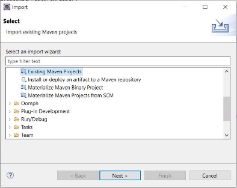
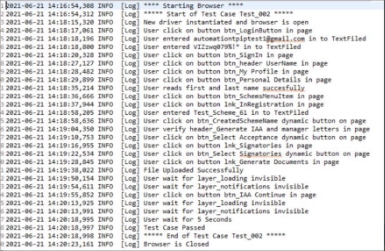
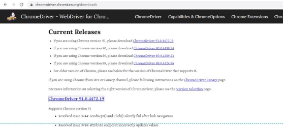
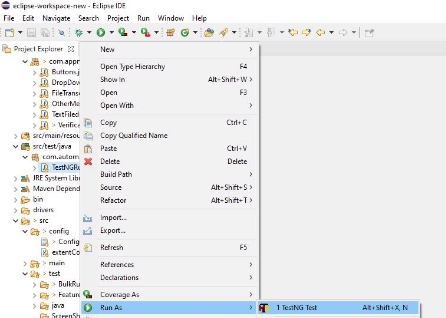
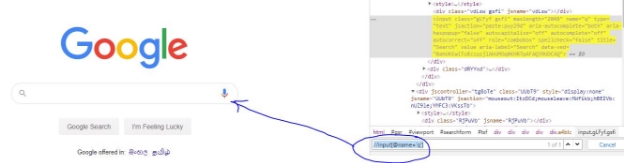
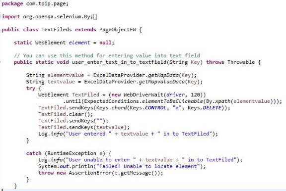

**1.  Framework Setup Instructions** 

1. Prerequisite Requirements: 
- Programming Language- Java version 8 
- IDE: Eclipse IDE Version: 2019-12 (4.14.0) or higher 
2. Folder Structure: Advise to have the project folder structure as below under “C” drive to make it consistent across all test machines. 

- General\* – To keep any documents relating to the project. 
- IDE – To keep the required Integrated Development Environment (E.g. Eclipse). 
- Java\* – This can be used to keep any jar files that are required to keep locally. 
- PIC\* – This can be used to keep any application screen shots, or any images required for any verifications. 
- TestReports – This is the path set to save the Test Reports generated at the end of the test run. 
- WorkSpace – Copy the project into this folder to maintain it locally.  

\* - Optional 

3. Eclipse Configurations: 
- Install Cucumber plugin (Help ->Eclipse Market Place) 

- Install TestNg plugin (Help ->Eclipse Market Place) 

**2. Importing the Project and configurations** 
1. Select File -> Import from top menu. 
2. Import the solution as “Existing Maven Project”. 

3. Set up the location for reports. This can be ignored if the folder structure is configured as specified above in section 1.b. 
- Create a location for reports in your local machine 
- Open Configuration.properties in src -> config 
- Change the below location path accordingly 

4. Create a folder as “ScreenShotFolder” inside src/test as below. 

This folder is to save screen shots for any failed test steps that will be attached to the final Test Report. This folder will be refreshed at every run and therefore will be blank if no failures occurred during the test run.  

5. Create a folder as “logs“ inside target as below. 

This folder holds the log file which save all the custom log messages defined from start to end of each test script. This gives a comprehensive detail on what happened during the execution of each test script. A sample log file also showed in the second image.  

6. Check the Chrome Driver version to make sure it supports the current Chrome browser in the run machine. If not supported, follow the steps given below. 
- download the relevant Driver from the following site. 

   [https://chromedriver.chromium.org/downloads ](https://chromedriver.chromium.org/downloads) 

- Copy the latest Chrome Driver into the following folder and refresh the project through your IDE. 

- Open Configuration.properties in src -> config and change the driver accordingly. 

7. Change the path for “Downloads” folder in your local machine as below. 

**3. How to add new feature file** 

Right click on folder that need to create feature file (Bulk or Feature) and add file. Give a suitable name with .feature extention. For example - automation test.feature 

**4. How to run the Test Scripts** 

Right Click on TestNGRunner class in src/test/java folder and run as TestNG Test. 

**5. Scripting Best Practices** 
1. Avoid using Thread.Sleep() method as much as possible to handle page load delays because this slows the execution speed. Most cases the page or the page element will be loaded in a lesser period of time compared to the time specified in the Sleep method. The best practice here is to use explicit wait.**  
2. Do not hard code the Application URLs at the script level. Always try to configure the application URL in a simple configurable text file.**  
3. Do not specify the actual file path in the code. As an example, always use the relative path as [“\\src\\test\\TestData”](file://///src/test/TestData) to specify the location to the test data folder rather than specifying the actual folder path in the running machine.**  
4. Try to use common methods as much as possible to reduce the code rather than defining different methods to perform the same task.**  
5. Add comments to the code every time which allows the readers to get a better understanding about what the specific piece of code does.

**6. Types of element locators** 

|**Locator** |**Description** |
| - | - |
|ID |To find the element by ID of the element  |
|ClassName |To find the element by Class name of the element |
|Name  |To find the element by name of the element  |
|Link Text |To find the element by text of the link  |
|XPath |XPath is used to locate a web element based on its XML path. |
|CSS Selector |CSS Selectors are string patterns used to identify an element based on a combination of HTML tag, id, class, and attributes. CSS path also locates elements having no name, or ID. This is more complicated than previous methods. |

❑  XPath contains the path of the element situated at the web page. Standard format for creating XPath is as below: 

|**XPath=//tagname[@attribute='value']** ||
| - | - |
|// |Select the current node |
|Tagname |Tagname of the particular node.  |
|@ |Select attribute.  |
|Attribute |Attribute name of the node. |
|Value |Value of the attribute.  |

**E.g. //input[@name='q']** 

**7. Coding Standards** 

1. When creating new feature file use below format. 

- Naming conversion - [TestID]_[TestCaseName]

**e.g. -** 

- Before start scripting, follow the template as below, 

#Test Case ID: [TestCaseID] 
#Summary: [TestCaseName] 
#Author:  [AuthorName]

@ProjectName

Feature: [TestID]_[TestCaseName] 
Scenario: [TestID]_[TestCaseName]
      

[Starting Scripting..]

 **e.g. -** 

2. Pass all data which is using in test scripts through masterDataSheet.xlsx. Do not hard code xpath values and test data inside class methods. 

Example: 

`              `**Method to read Locator xpath via excel.** 

String elementvalue = ExcelDataProvider.*getMapData*(Key);**   

`              `**Method to read Locator test data via excel.** 

String textvalue = ExcelDataProvider.*getMapvalueData*(Key); 

3. Variable names in MaterDatasheet should be named according to below format. 

|**Variable** |**Prefix** |
| - | - |
|Button |btn |
|Link |lnk |
|Upload file |file |
|Text Field |txt |
|Drop Down |drp |
|Header lines |header |
|Audit Messages |msg |
|System Notifications |not |
|Check box |chk |
|Tab names |tab |

4. Keep step definitions methods and relevant selenium code separately. 

`         `Inside **com.tpip.impl** package contains all the step definition methods 

Sample code snippet for Step definition method  

Inside the step definition, call the method for selenium method which is available in **com.tpip.page** package. 

Sample code snippet for selenium method which is called inside step definition method. 

5. When writing new method always use try/catch method to handle both pass and fail cases as below 

6. Always add log details in each method. Inside both try and catch blocks appropriately, with understandable message. Each log message will be tracked in TPIPAutomation.log log file available under Target -> logs ->  

